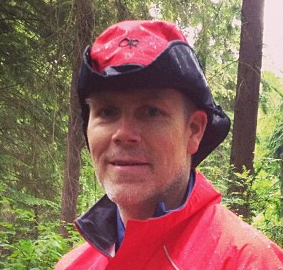

# Class Information

## Meeting Times and Locations

If you're reading this, you are probably a student enrolled in Section C of MTH 112, Fall 2026.  While the other two sections of MTH 112 are covering the same material with a similar course structure, some details will differ. Our section meets at the following times and places:

- MWF 1:35-2:30, DB 230
- T 11:20-12:15, DB 230

## Instructor

::: columns
::: {.column width="65%"}
Chris Hallstrom, PhD   (he/him)

Students sometimes ask how they should address me. While I won't be offended if you use my first name, I know that many students aren't comfortable doing so. I also recognize that I have some amount of privilege in this regard and that many of my colleagues would find it disrespecful or presumptuous to use first names. In solidarity with them I'd suggest that you call me "Dr. Hallstrom" or "Prof. Hallstrom".

-   ["My First Name"](https://docs.google.com/document/d/1bGDW6BChhG-DvPlli__AoJJQUf0TfFrL9tFEJNgTvvs/edit?usp=sharing) by Susan Harlan, *The South Carolina Review*, 2017 (49.2)

-   ["Tenure, She Wrote"](https://tenureshewrote.wordpress.com/2014/03/11/feel-ree-to-call-me-dr/)

:::

::: {.column width="5%"}
:::

::: {.column width="30%"}

:::
:::

### Contact Information

- Office: Buckley Center 270 -- on the second floor of the NW wing (my window overlooks the main quad). While I do have specific times set aside for [drop-in hours](support.qmd#drop-in-hours), you are always welcome to stop by at anytime!
- Office Phone: (503) 943-7165
- Email: [hallstro\@up.edu](mailto: hallstro@up.edu)

[hallstro\@up.edu](mailto:hallstro@up.edu){.btn .btn-primary}

Email is a good way to communicate with me. If you send me email after 5pm, however, there's a good chance that I will not see it until the following morning. Similarly, I don't check my email regularly on weekends so you might not get a reply until Monday. I will do my best to respond as soon as I am able, but if you haven't heard back from me in a timely manner - please feel free to follow-up!

## Drop-In Hours

I am tentatively scheduling drop-in help hours during the following times:

- MW 9:30-10:30
- TR 1-2:30

You are welcome to stop by during these times to ask questions or get help on any aspect of the class.  Note that it's okay if don't have a specific question -- if you're feeling lost or uneasy about anything, please stop by!

## Course Materials

### Textbook

We will be using the open source textbook [Active Prelude to Caclulus](https://activecalculus.org/apc/) by Matthew Boelkins. This is a free, open-source text available in both online (HTML) and PDF versions:

[Online Version](https://activecalculus.org/prelude/){.btn .btn-info}

[PDF Version](https://scholarworks.gvsu.edu/books/20/){.btn .btn-info}

I highly recommend that you use the online version as it will give you access to interactive problems embedded in the text.  I do suggest downloading the pdf version just in case you need to access the text but don't have internet access.

If you really want a print version, you can purchase that [direct from Amazon](https://www.amazon.com/Active-Prelude-Calculus-Matthew-Boelkins/dp/1085940853/) for the cost of printing ($17 last time I checked).  This is certainly not necessary however!

### Course Pack

The activites that we will do in class are all (mostly) contained in the Course Pack available at the campus bookstore.  I recommend that you purchase this (again for the cost of printing).  You can also find a pdf here:

[Course Pack](materials/MTH112_course_pack_F26.pdf){.btn .btn-info}

Any additional handouts or course materials will be posted on our class Canvas page. I will also regularly post a summary of our class activities so if you ever miss class for any reason, you can check there to see what you missed.

### Technology

In order to access course materials, I expect that you has access to some kind of device -- a desktop computer, laptop, or tablet.  We will also make use of the online graphing tool [Desmos](https://www.desmos.com/calculator) so if you don't already have a free Desmos account, I recommend that you sign up for one. It's not absolutely necessary, but it does allow you to save your work. Which is nice! 

In class, we will often be working in small groups and while it's not necessary that everyone in the group has a device, it's important that at least one person does.   Note that if you already have a graphing calculator, you may find that useful, but my experience is that Desmos is the better tool for our needs.

From time to time, we may also make use of online tools such as Wolfram Alpha for certain calculations. We will discuss in class when such tools are approprate. Note that GenAI tools such as ChatGPT are **not** appropriate for doing mathematics. Again, we will discuss why this is throughout the semester.

Finally, if you need any assistance getting access to technology, please let me know!

## Important dates {#sec-important-dates}

-   **Mon, Aug. 24:** Classes begin
-   **Fri, Aug. 28:** Last day to add/drop
-   **Mon, Sep. 7:** Labor Day -- no classes
-   **Tues, Oct. 6:** Mid-semester check-in
-   **Mon-Fri, Oct. 12-16**: Fall Break
-   **Wed, Oct. 28:** UP Next -- no classess
-   **Mon, Nov 22:** Last day to Withdraw
-   **Thur-Fri, Nov 26-27:** Thanksgiving Break
-   **Fri, Dec 4**: Last day of classes
-   **Mon, Dec 7**: Final check-in, 1:30-3:30


