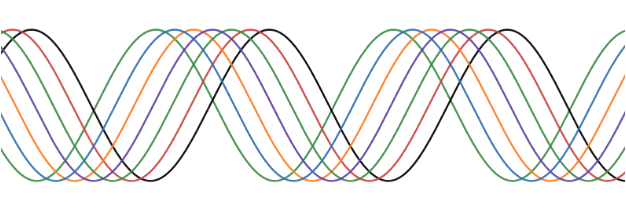

{width="100%" fig-alt="decorative image" fig-align="center"}

::: {.center .large}
# Welcome!
:::

In this course we will cover the foundational mathematical ideas necessary for the study of calculus including modeling and representing exponential, logarithmic, rational, and trigonometric functional relationships. We will also work on developing a productive mathematical disposition, including persistence in problem-solving, evaluating the reasoning of others, and formulating mathematical justifications. Targeted toward students continuing to MTH 201, this course does not fulfill the core requirement.

Throughout the semester, you will be asked to make sense of your own mathematical thinking and to analyze the thinking of others.  You may already have some familiarity with some of the course material, but would likely benefit from further study. Much like a literature class, you may read *Romeo and Juliet* in high school, and then again in a upper division college literature course. While the text is the same, the depth of analysis will be deeper and the resulting understanding more substantial. In just the same way, our study of functions will hopefully give a new perspective into how mathematics works. Along the way, I hope for you to deepen your understanding of how you learn best, and to become a part of a supportive community of like-minded learners.

::: {.pinkbox}

::: {.center}
## You Belong Here!
:::

In our classroom, diversity and individual differences are respected, appreciated, and recognized as a source of strength. It is our collective responsibility to create a welcoming space where ideas can be challenged while individuals are respected. I ask you to support one another as you develop as mathematicians and analytic thinkers.
:::

