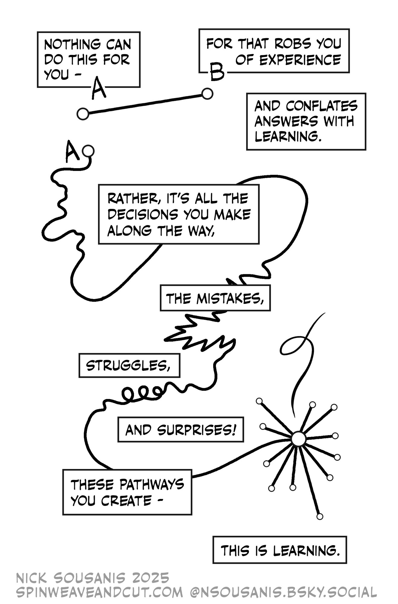

## "AI"

::: {.callout-note appearance="simple" icon="false"}
Using LLM tools such as ChatGPT on **homework** or other **submitted work** fundamentally undermines our learning goals and will be considered a violation of UP's academic integrity policy. If I see work that I suspect may have been produced by or with the help of AI tools we will have a conversation about it. Note that I am obligated to share any concerns around academic integrity with the Dean of Students.

In addition to work you turn in I strongly suggest, for the reasons articulated below, that you **don't use** AI tools **in any other capacity** for this class.

These AI policies apply only to this course. For your other courses, please follow those professors' AI policies, which may differ from mine.
:::

::: columns
::: {.column width="45%"}
Generative AI tools such as ChatGPT work by predicting what words will form coherent sentences in the context of the prompt you've given it, essentially ["autocomplete in overdrive"](https://thebullshitmachines.com/lesson-1-autocomplete-in-overdrive/index.html). This means that Gen AI tools are **designed** to produce output that **sounds convincing** without any regard to whether its output is **actually correct**.  The technical term for this is [bullshit](https://thebullshitmachines.com/lesson-2-the-nature-of-bullshit/index.html) 

This also means that they **are not actually doing any mathematics.** If ChatGPT can do a calculus problem its because it was trained on an immense catalogue of calculus materials (without the author's permission). It also means that there's absolutely no promise that any answers you get from generative AI are correct.

I sometimes hear students say that they use AI as a "study aid" to do things like help explain concepts, to summarize content, or to check their work.

Here's the thing -- those are all activities that are fundamental to the process of learning!  Struggling to build your own understanding - to make sense of difficult concepts - is the whole point. If you use Gen AI to do these tasks, you are giving up opportunities to learn. Don't undermine your growth as a human learner by looking for shortcuts!

:::

::: {.column width="5%"}
:::

::: {.column width="50%"}

:::
:::

Fundamentally, I believe that the use of AI tools in this class ultimately gets in the way of authentic learning.

Beyond their use in this class, there are many other reasons why you might be critical about the use of AI tools in general, many of which of are touched upon in this passage from Anthony Moser's essay ["I Am An AI Hater."](https://anthonymoser.github.io/writing/ai/haterdom/2025/08/26/i-am-an-ai-hater.html)

> Critics have ... written thoroughly about the [environmental](https://www.teenvogue.com/story/chatgpt-is-everywhere-environmental-costs-oped) [harms](https://www.bbc.com/news/articles/cy8gy7lv448o), the [reinforcement](https://apnews.com/article/ai-artificial-intelligence-health-business-90020cdf5fa16c79ca2e5b6c4c9bbb14) of [bias](https://www.noemamag.com/the-exploited-labor-behind-artificial-intelligence/) and generation of [racist output](https://www.npr.org/2025/07/09/nx-s1-5462609/grok-elon-musk-antisemitic-racist-content), the [cognitive harms](https://www.bloomberg.com/news/articles/2025-08-12/ai-eroded-doctors-ability-to-spot-cancer-within-months-in-study?embedded-checkout=true) and [AI supported suicides](https://www.nytimes.com/2025/08/26/technology/chatgpt-openai-suicide.html), the problems with [consent](https://www.404media.co/deepfake-harassment-ohio-undress-clothoff-nudify-apps/) and [copyright](https://jskfellows.stanford.edu/theft-is-not-fair-use-474e11f0d063), the way AI tech companies further the [patterns of empire](https://karendhao.com/), how [it's a con](https://thecon.ai/) that enables [fraud](https://voiceofsandiego.org/2025/04/14/as-bot-students-continue-to-flood-in-community-colleges-struggle-to-respond/) and [disinformation](https://www.technologyreview.com/2023/10/04/1080801/generative-ai-boosting-disinformation-and-propaganda-freedom-house/) and [harassment](https://www.reuters.com/world/us/fbi-says-artificial-intelligence-being-used-sextortion-harassment-2023-06-07/) and [surveillance](https://www.aclu.org/news/privacy-technology/machine-surveillance-is-being-super-charged-by-large-ai-models), the [exploitation of workers](https://www.wired.com/story/millions-of-workers-are-training-ai-models-for-pennies/), as an [excuse to fire workers](https://www.theverge.com/news/688679/amazon-ceo-andy-jassy-ai-efficiency) and de-skill work, how they [don't actually reason](https://machinelearning.apple.com/research/illusion-of-thinking) and probability and association are [inadequate to the goal of intelligence](https://thegradient.pub/machine-learning-wont-solve-the-natural-language-understanding-challenge/), how people think it makes them faster when it [makes them slower](https://metr.org/blog/2025-07-10-early-2025-ai-experienced-os-dev-study/), how it is inherently mediocre and fundamentally conservative, how it is at its core a [fascist technology](https://newsocialist.org.uk/transmissions/ai-the-new-aesthetics-of-fascism/) rooted in the [ideology of supremacy](https://aworkinglibrary.com/writing/toolmen), defined not by its technical features but [by its political ones](https://ali-alkhatib.com/blog/defining-ai).

## Collaboration

Unless otherwise instructed, I encourage you to work together with classmates on homework or other assignments although any work that you hand in should be your own.  You should also acknowledge your collaborators. Unless otherwise instructed, all check-ins should be done individually.

