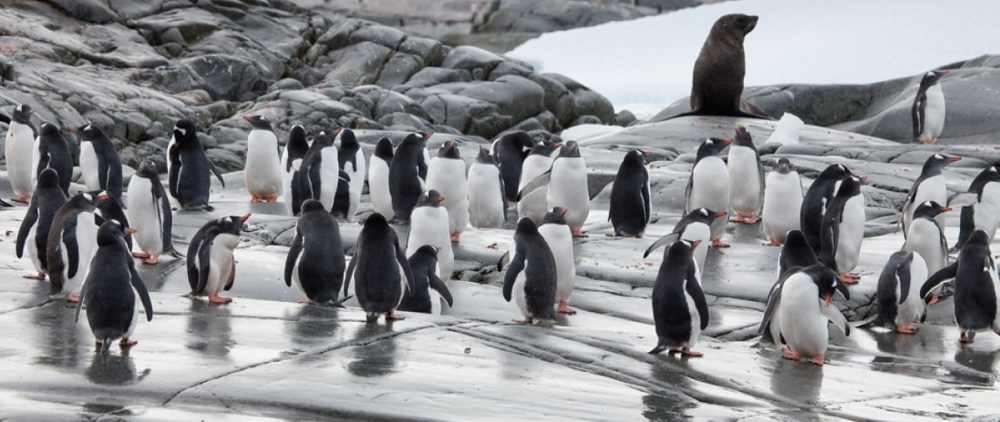
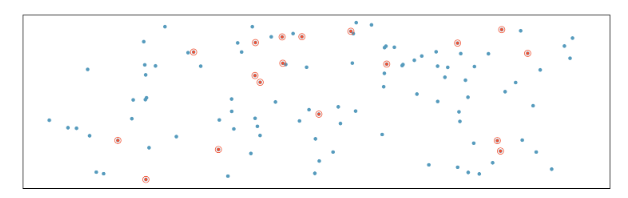
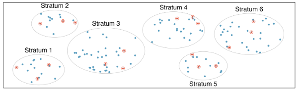
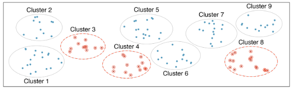
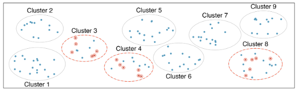
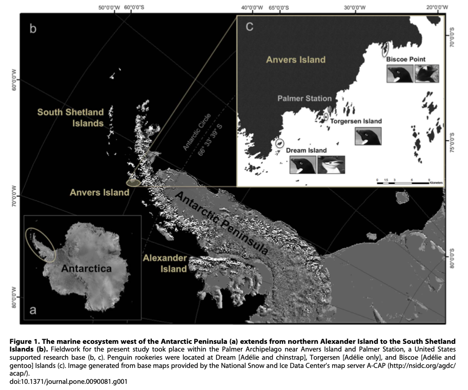

## In groups of 3-4...

-   What do you like to be called?
-   Where do you consider home?
-   What is your major?
-   Find one uncommon thing that you all have in common.

\

::: {.blue}
**Facilitator** (person closest to the door): Make sure everyone has a chance to share.

**Representative** (person farthest from the door): Share your group's uncommon commonality with the class
:::

## 

::::: columns
::: {.column width="50%"}
**Facilitator** (person closest to the door):

Make sure everyone has a chance to share.
:::

::: {.column width="50%"}
**Representative** (person farthest from the door):

Share your group's uncommon commonality with the class
:::
:::::

## Review Penguins

```{r}
#| label: load-packages
#| warning: false
#| message: false
#| echo: false

library(tidyverse)
library(palmerpenguins)
```

```{r}
print(penguins)
```

------------------------------------------------------------------------

```{r}
glimpse(penguins)
```

**Same data** just presented differently!

Data is **tidy** - each row is an observation - each column is a variable - each entry is a single value (or NA)

[what does **untidy** data look like?](https://portlandpilots.com/sports/womens-basketball/stats/2022-23)

## Other questions

-   Why the underscores in variable names? E.g. `bill_length_mm`
-   Variable type
    -   `<fct>` is **factor** - this is what R calls categorical
    -   `<int>` is **integer** - numerical
    -   `<dbl>` stands for **double precision floating point** - how computers handle numbers with decimals
-   What is `NA`?
    -   Missing data - in this case researchers likely weren't able to obtain measurements for that penguin.

## Where did this data come from?

### Begin with Research Question(s)

\
**Can physical measurements be used to determine sex in penguins?**

{fig-align="center" width="800"}

------------------------------------------------------------------------

From 2007 to 2009 Dr. Kristen Gorman and colleauges collected data to try to answer this and other questions.

{fig-align="center" width="800"}

## Observational Study

-   What is the **population** in question?

    -   Collect data for every case in the population -\> **census**

    -   Collect data for smaller fraction -\> **sample**

-   Find (calculate) a numerical summary relevant to our question.

    -   Number calculated for entire population -\> **parameter**
    -   Number calculated for sample -\> **statistic**

\

### Hopefully, the statistic is close to the parameter!

## Sampling Methods

Goal: choose sample so that it accurately represents the population.

\

**Challenges** (making sure sample represents entire population)

-   **non-response** rates in surveys
-   How were samples chosen -- are they truly random?
-   watch out for **convenience** samples!

## Simple Random Sample

{fig-align="center" width="1000"}

Simple to understand, but often difficult to implement for large populations!

## Stratified Sampling

{fig-align="center" width="1000"}

Population is divided into groups (**strata**). Then another method (e.g. simple random sampling) is used within each stratum.

## Cluster Sample

{fig-align="center" width="1000"} Population divided into groups (**clusters**) and a fixed number of clusters are chosen (sampled). All observations within a cluster are used.

-   Typically, clusters are similar to each other

## Multistage Sampling

{fig-align="center" width="1000"}

Again, clusters -- but then sampling within the clusters.

## Penguins

Three separate populations: all Gentoo, Adelie, Chinstrap penguins in Palmer Archipelago region of Antarctica.

Q: How would **you** sample?

## Palmer Archipelago

{fig-align="center" width="900"} \## For Thursday

-   Finish reading Chapter 2
-   Homework: Section 2.5, #20, 24, 29
