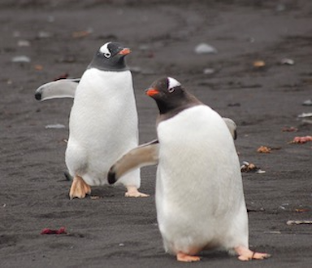
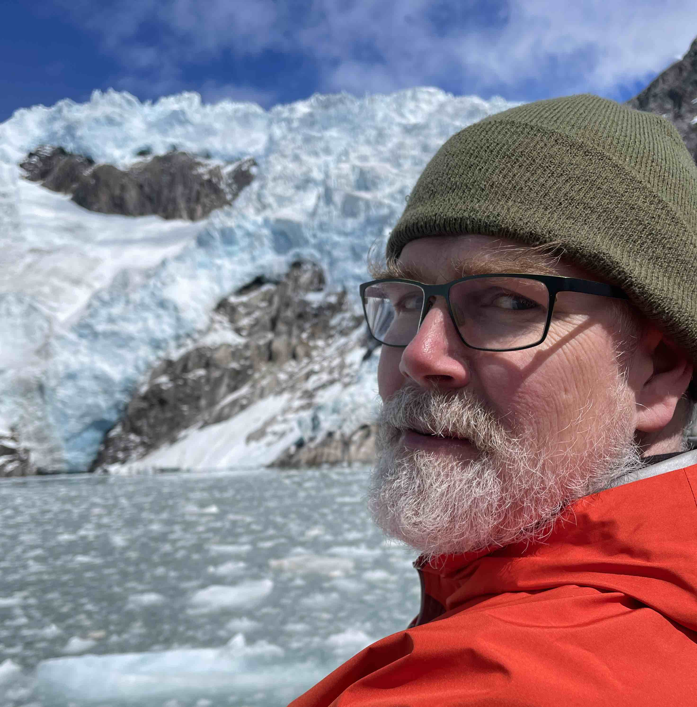
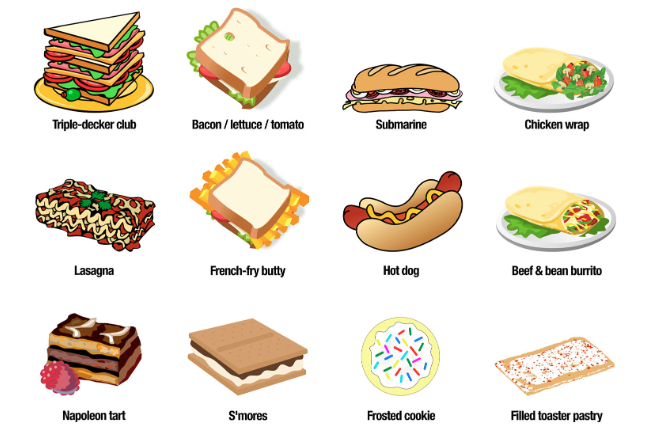

## Welcome to Precalculus!

::::: columns
::: {.column width="50%"}
MTH 112, Section C

-   MWF 1:35 - 2:30, DB 230
-   T 11:20 - 12:15, DB 230

- designed to prepare students for Calc I (MTH 201)
- does not satisfy core requirement
- If you believe you should take 201, talk to me after class!
:::

::: {.column width = "50%"}
{width=75% fig-align="center"}
:::

:::

## Your professor

::::: columns
::: {.column width="60%"}
Chris Hallstrom, PhD  ( he / him)

-   [hallstro\@up.edu](mailto:hallstro@up.edu)
-   Buckley Center 270
-   Drop-in hours
    - MW 9:30-10:30
    - TR 1-2:30
-   [calendly.com/hallstro](https://calendly.com/hallstro)
-   stop by anytime!

:::

::: {.column width="40%"}
{width=75% fig-alt="Headshot of Chris Hallstrom" fig-align="left"}

::: {.small}
from Salem, Oregon

3 kids (ages 17-21)

I play basketball & make wine

:::

:::
:::

## In groups of 3-4...

-   What do you like to be called?
-   Where do you consider home?
-   What is something you like doing in your free time?
-   Find one *uncommon* thing that you all have in common.

::: {.blue}
Choose a **Representative** who will share your group's uncommon commonality with the class
:::

## 

Which of these are sandwiches?  Why or why not? (5 min)

{width=85%" fig-align="center"}

##

In your groups, compare definitions.  Why were some items and not others circled?  See if you can come up with a definition that everyone in the group can agree with.

