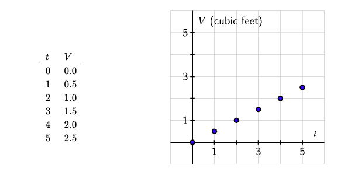
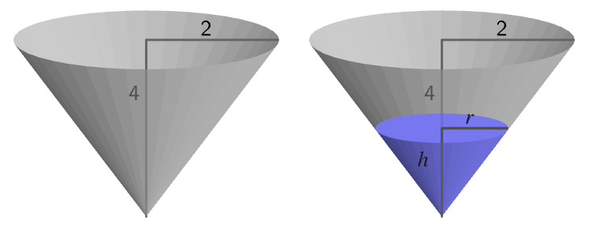

## This week

-   WeBWorK A1 due Friday 7pm
-   Weekly Engagement Report due 5pm (on Canvas)
-   Preview Activity 1.2.1 complete on paper and bring to class

## WeBWorK

-   [webwork.up.edu/webwork2/MTH112C-F26/](https://webwork.up.edu/webwork2/MTH112C-F26/)
-   login with your UP credentials. If that doesn't work, use your UP
    username as both login and password (then reset your password)
-   Focus on problems that feel productive
-   Although WeBWorK keeps track of points, I do not. I'm only tracking
    if you do it or not

## Getting Help

-   Ask classmates
-   Post questions to Canvas Discussion Board (new!)
-   Visit my drop-in hours
    -   MW 9:30-10:30
    -   TTh 1-2:30
-   schedule a visit
    [calendly.com/hallstro](https://calendly.com/hallstro)
-   send me an email
-   course videos

## Math Resource Center (MRC)

Located in the Learning Commons (BC 163)

-   Drop-in tutor hours
    -   3-7pm Mon-Thurs
-   By appointment: sign up at MRC home page
    [ww1.up.edu/learningcommons/tutoring-services/math-resource-center/](https://ww1.up.edu/learningcommons/tutoring-services/math-resource-center/)

## What about using "AI"?

-   Why did I put "AI" in quotes?

-   What do y'all think about appropriate use of AI in this class?

-   [Course
    Policy](https://portland.instructure.com/courses/2680/pages/course-information){target="_blank"}

## 

### 1.1.2 Using Graphs to Represent Relationships

a graph is plot of *ordered pairs* $(t, V)$ on *coordinate axes*

{fig-align="right" width="90%"}

## 

### Can also (sometimes) use variables

Volume of box with length $l$, width $w$, height $h$
$$ V = l\cdot w \cdot h$$

In our example, we're actually interested in the box of **water** (not
the entire aquarium). Since $h$ is changing, we leave that as a
variable: $$ V = 4 \cdot 2 \cdot h = 8h$$

## 

### Changing perspective

What if we were interested in how how the water depth is changing as we
fill the tank? Start with previous relationship $$ V = 8h $$ and rewrite
to express $h$ in terms of $V$:

$$ \frac{1}{8} V = \frac{1}{8} 8h = \left ( \frac{8}{8} \right ) h = h$$
$$ h = \frac{1}{8} V$$

##
### Conical Tank (point down)

{fig-align="center"}

$$ V = \frac{1}{3} \pi h r^2 $$

As water is added, volume is increasing -- both $r$ and $h$ are changing

##
### But $r$ and $h$ are **related**!

{fig-align="center"}

Similar triangles (side view) means ratios are the same:
$$
\frac{2}{4} = \frac{r}{h}
$$
